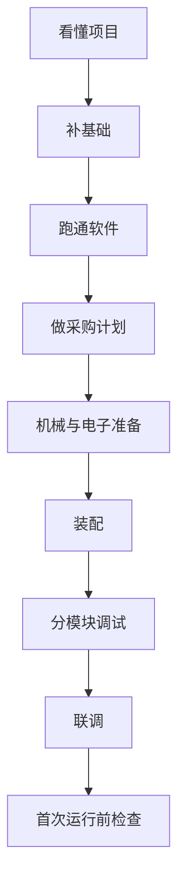

# red-panda-afm 零基础复现知识库首页

## 这一页是干什么的
这是整个 Obsidian 知识库的总入口。你可以把它当成“课程主页 + 项目总控台”：今天该做什么、下一步去哪一页、哪些信息已经确认、哪些还没确认，都从这里出发。

## 你会学到什么
- 这个知识库适合谁，用来解决什么问题
- 你现在最该做的一件事
- 一条完整的学习与复现路线
- 不同状态（刚入门 / 已采购 / 已装配）应该看哪些页
- 这个项目最容易踩坑的地方
- 哪些资料是仓库里还不完整、必须后续补齐的

## 先决条件
- 无。你可以直接从这页开始。

## 预计耗时
- 第一次完整看完：20~30 分钟
- 每天回看导航：3~5 分钟

## 正文

### 这个知识库是干什么的
这是围绕开源项目 `red-panda-afm` 做的“从 0 到 1 复现课程”。目标不是只看懂 README，而是让你一步步走到：
- 看懂项目结构
- 建立采购策略
- 跑通软件环境
- 准备机械与电子部分
- 完成装配、分模块调试、联调
- 做第一次运行前检查

### 适合谁使用
- 高中生
- 零基础新手
- 想认真复现开源硬件项目，但不想被术语劝退的人

### 你现在最该做的一件事
> 今天先做这一件：
> 打开 [[00-首页/01-学习路线图]]，看懂 9 个阶段，不要急着买核心器件。

### 完整学习路线（先学再做）
1. [[01-项目总览/01-这个项目到底是什么]]：知道你在做什么
2. [[03-仓库阅读与信息提取/01-先读README和BUILD_GUIDE]]：确认仓库到底给了什么
3. [[04-复现总计划/01-总阶段划分]]：知道整体工程节奏
4. [[02-零基础预备知识/01-电子基础入门]]：补最基本概念
5. [[06-软件环境搭建/01-电脑环境准备]]：先把软件跑起来
6. [[05-采购与预算/01-采购总说明]]：再做采购决策
7. [[08-机械与3D打印部分/01-机械结构在项目中的作用]] + [[07-PCB与电子部分/01-这块板子是干什么的]]：进入硬件准备
8. [[13-装配流程/01-整机装配前总检查]] + [[14-调试与联调/01-为什么要分模块调试]]：分模块联调
9. [[15-第一次运行与校准/01-第一次运行前最后检查]]：第一次运行前确认

### 如果我今天只有 30 分钟，我该看哪几页
- 第 1 组（必须）：[[01-项目总览/01-这个项目到底是什么]]
- 第 2 组（必须）：[[03-仓库阅读与信息提取/07-仓库里已经明确的信息]]
- 第 3 组（必须）：[[03-仓库阅读与信息提取/08-仓库里缺失的信息]]
- 第 4 组（可选）：[[16-风险、安全与现实预期/01-这个项目有哪些风险]]

### 如果我已经开始买器件了，我该看哪几页
- 先停一下，看 [[01-项目总览/05-先别急着买东西]]
- 再看 [[05-采购与预算/01-采购总说明]]
- 再看 [[05-采购与预算/04-哪些信息目前还不能确定]]
- 然后看 [[17-待确认与工程补全/01-BOM待确认]]

### 如果我已经开始装配了，我该看哪几页
- [[13-装配流程/01-整机装配前总检查]]
- [[13-装配流程/02-推荐装配顺序]]
- [[14-调试与联调/02-先调什么后调什么]]
- [[14-调试与联调/07-整机联调顺序]]

### 本项目最容易踩坑的地方
- 一上来就买很多核心器件，结果后面发现型号/接口不匹配
- 没先跑通软件环境，就直接上硬件
- 没做分模块测试，直接整机硬上
- 把“第一次目标”定成完美成像，导致挫败
- 忽略激光、上电、短路、探针损坏风险

### 我现在不懂很正常
你现在不懂 AFM、PCB、压电、串口、GUI 都很正常。这个项目本身就是跨学科工程项目，不是“看一篇文档就能马上做出来”的类型。你要做的不是“一次学会全部”，而是“今天只完成一个小里程碑”。

### 待确认信息提醒（非常重要）
根据当前仓库扫描结果，`red-panda-afm` 并不是完整工业交付包：
- 目前仓库可见：`cad/`、`firmware/`、`gui/`、`pcb/`
- `pcb/` 只有 `ProPrj_red-panda-afm_2025-05-21.epro`
- 未直接看到独立发布的 BOM、Gerber、Pick-and-Place、装配图
- 文档（README/BUILD_GUIDE）偏概述，细节仍需从源码和工程文件继续核对

请先看：[[03-仓库阅读与信息提取/09-待确认问题总表]]

> [!warning] 暂停购买提醒
> 在你没完成“仓库信息确认 + 软件环境验证”之前，不建议一次性采购核心器件（尤其是光学/压电/驱动相关器件）。

> [!tip] 现实预期提醒
> 第一次目标是“系统逻辑跑通、模块可控、能看到可解释信号”，不是马上做出完美纳米图像。

## 用最简单的话再说一遍
先别急着买。先看懂项目，再补基础，再跑软件，再做采购，再做硬件。你每次只做一步，就不会迷路。

## 在 red-panda-afm 项目里它对应什么
- 仓库位置：`red-panda-afm/`
- 重点目录：`cad`、`firmware`、`gui`、`pcb`
- 你要做的是把这些零散内容变成可执行流程

## 这一页完成后，你应该能做到什么
- 知道本知识库怎么用
- 知道你今天的第一步是什么
- 知道本项目哪些信息还缺失
- 知道不应该盲目采购

## 常见误区
- 误区 1：我只要看 README 就能开做
- 误区 2：先把东西全买了再说
- 误区 3：第一次必须扫出很漂亮的图

## 下一页
- [[00-首页/01-学习路线图]]
- [[01-项目总览/01-这个项目到底是什么]]
- [[02-零基础预备知识/01-电子基础入门]]

## 导航
- 上一页：无（首页）
- 下一页：[[00-首页/01-学习路线图]]
- 返回首页：[[00-首页/00-首页]]
