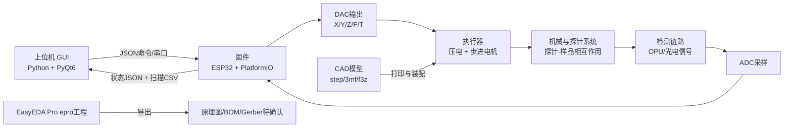
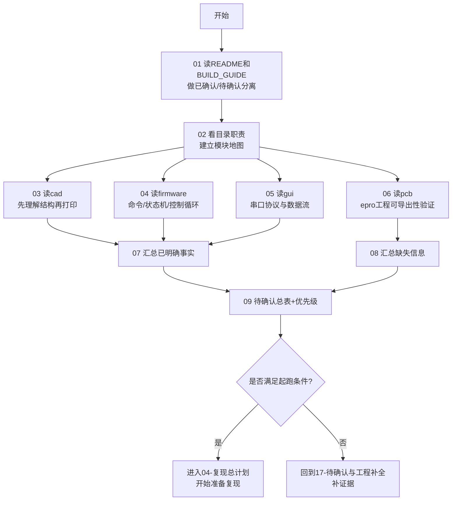

# 本模块总览与使用方法

## 这一页是干什么的
这页是 `03-仓库阅读与信息提取` 的总入口。你可以把它当作“开工前的侦察地图”：先看懂仓库，再决定怎么复现，不盲冲。

## 你会学到什么
- 怎么按顺序读 `red-panda-afm` 仓库
- `cad / firmware / gui / pcb` 各自负责什么
- 为什么必须先做“信息提取”，再做“采购和装配”
- 看完这一模块后，你应该具备哪些能力才能开始复现

## 先决条件
- [[00-首页/00-首页]]
- [[01-项目总览/03-red-panda-afm 项目结构总览]]

## 预计耗时
- 快速路线：2~3 小时
- 认真路线：1~2 天

## 正文

## 先看系统总览图（概念原理图）

> 说明：这是“功能原理图（概念）”，不是可直接生产的电路原理图。真实电路原理图在 `pcb/*.epro` 内。

## 仓库阅读路线图（你照着走就行）

## 每个部分的作用（必须说清楚）
| 部分 | 作用 | 你在本模块要产出什么 |
|---|---|---|
| `README*` / `BUILD_GUIDE*` | 给项目目标、总体流程、风险提醒 | 一份“已确认 vs 待确认”清单 |
| `cad/` | 机械结构设计来源 | 一份“先打印哪些件、先不打哪些件”计划 |
| `firmware/` | ESP32 控制逻辑和命令协议 | 一份命令表 + 状态机理解 |
| `gui/` | 上位机控制、数据接收、图像导出 | 一份 GUI-固件通信链路图 |
| `pcb/` | 原理图与PCB工程源（EasyEDA Pro） | 一份“能否导出BOM/Gerber/PnP”的验证记录 |

## 需要准备什么
- 一个可读 Markdown 的环境（Obsidian）
- 一个代码查看器（VSCode）
- 基础命令行能力（会 `ls`、`rg`、`cat` 即可）

## 一步一步怎么做
1. 按页顺序从 `01` 读到 `09`，不要跳读。
2. 每一页都把“已确认信息”复制到你的记录页。
3. 每看到不确定项，立刻加入 [[03-仓库阅读与信息提取/09-待确认问题总表]]。
4. 做完 `09` 后，对照“起跑条件”决定进下一阶段还是继续补资料。

## 每一步完成后怎么检查
- 你是否能用自己的话解释“系统数据怎么流动”？
- 你是否知道哪些信息是仓库明确给出的，哪些是空缺？
- 你是否已经写出“不能盲买”的证据？

## 出错时先看哪里
- 看不懂目录：回到 [[03-仓库阅读与信息提取/02-仓库目录逐个解释]]
- 看不懂命令：回到 [[03-仓库阅读与信息提取/04-firmware目录怎么读]]
- 看不懂扫描数据：回到 [[03-仓库阅读与信息提取/05-gui目录怎么读]]
- 看不懂电路资料：回到 [[03-仓库阅读与信息提取/06-pcb目录怎么读]]

## 暂时做不到也没关系的部分
- 暂时不需要立刻打开每个 `.esch` 的全部细节
- 暂时不需要立刻买齐所有器件
- 暂时不需要追求“性能参数验证”

## 用最简单的话再说一遍
这一模块就是“先看懂地图再上路”。你先把仓库拆清楚，后面复现才不会乱花钱、乱走弯路。

## 在 red-panda-afm 项目里它对应什么
- `red-panda-afm/README.md`
- `red-panda-afm/BUILD_GUIDE.md`
- `red-panda-afm/cad/`
- `red-panda-afm/firmware/`
- `red-panda-afm/gui/`
- `red-panda-afm/pcb/`

## 这一页完成后，你应该能做到什么
- 能描述整个项目的“软硬件闭环”
- 知道本模块 9 页该按什么顺序读
- 知道什么时候可以进入复现计划，什么时候必须先补信息

## 常见误区
- 一开始就跳到采购或装配
- 把 BUILD_GUIDE 当成完整工业文档
- 不做“待确认表”，凭感觉推进

## 下一页
- [[03-仓库阅读与信息提取/01-先读README和BUILD_GUIDE]]
- [[03-仓库阅读与信息提取/10-源码证据索引]]

## 导航
- 上一页：[[02-零基础预备知识/10-OPU和光学检测是什么]]
- 下一页：[[03-仓库阅读与信息提取/01-先读README和BUILD_GUIDE]]
- 返回首页：[[00-首页/00-首页]]
