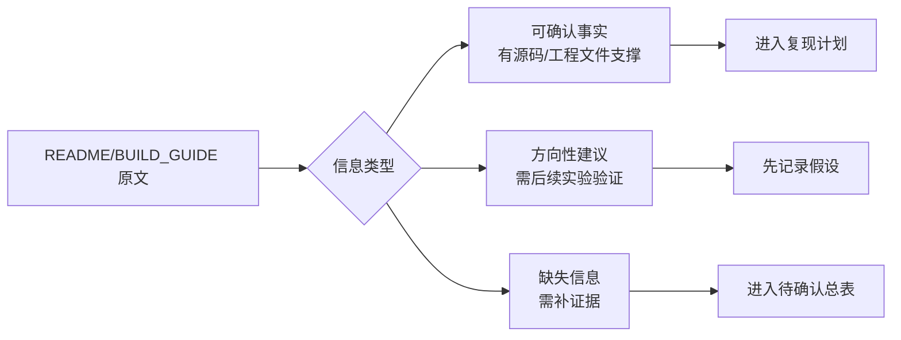

# 先读 README 和 BUILD_GUIDE

## 这一页是干什么的
这一页教你“怎么读文档才有工程价值”。不是把文档看完就结束，而是把信息分成：已确认、待确认、风险。

## 你会学到什么
- README 和 BUILD_GUIDE 的职责区别
- 文档里的内容哪些可以直接用，哪些不能直接信
- 如何做“证据化阅读”（每条结论都能对应到文件）

## 先决条件
- [[03-仓库阅读与信息提取/00-本模块总览与使用方法]]

## 预计耗时
- 45~60 分钟

## 正文

## 文档职责分工（先分清再读）
| 文档 | 主要作用 | 当前仓库状态 |
|---|---|---|
| `README.md` / `README_zh.md` | 项目介绍、入口说明 | 简洁，适合了解目标，不够支撑直接复现 |
| `BUILD_GUIDE.md` / `BUILD_GUIDE_zh.md` | 组装与调试方向说明 | 有指导意义，但细节层级偏概述 |

## 你应该怎么读（可执行流程）

## 需要准备什么
- 一个笔记页（建议用 [[18-模板与记录/03-问题记录模板]]）
- 两个栏目：`已确认`、`待确认`

## 一步一步怎么做
1. 先读 `README`，提取“项目目标、模块组成、最低要求”。
2. 再读 `BUILD_GUIDE`，提取“流程顺序、安全提醒、关键难点”。
3. 把每条结论写成“结论 + 证据来源文件”。
4. 发现文档里没有参数或没有文件时，直接记到待确认表。

## 每一步完成后怎么检查
- 每条“已确认”是否都能指向一个实际文件？
- 是否把“建议/目标”与“可执行参数”分开了？
- 是否已经列出“不能现在拍板的事项”？

## 出错时先看哪里
- 如果你发现“文档里写了但仓库找不到文件”，先检查路径，再记为缺失信息。
- 如果你发现“性能描述有但测试方法没给”，记为“不可直接复现实验条件”。

## 暂时做不到也没关系的部分
- 不需要立刻验证性能指标
- 不需要立刻理解每一个专业术语

## 文档阅读原理图（信息分层图）

## 当前可直接确认的内容（基于仓库文件）
- 这是一个开源 AFM 项目，目标是低成本 DIY。
- 仓库核心目录是 `cad / firmware / gui / pcb`。
- 构建说明强调机械、电子、光学、软件都要配合。
- 有安全提醒（激光、电气、机械探针风险）。

## 当前不能直接确认的内容
- 直接可下单的完整 BOM（文档未直接给出）
- 独立发布的 Gerber / Pick-and-Place（仓库根目录未直接给出）
- 标准化装配公差与工业级作业指导图

## 用最简单的话再说一遍
文档是“路线提示牌”，不是“完整施工蓝图”。你要一边读文档，一边去源码和工程文件里找证据。

## 在 red-panda-afm 项目里它对应什么
- `red-panda-afm/README.md`
- `red-panda-afm/README_zh.md`
- `red-panda-afm/BUILD_GUIDE.md`
- `red-panda-afm/BUILD_GUIDE_zh.md`

## 这一页完成后，你应该能做到什么
- 建好自己的“已确认/待确认”两栏
- 不会再把概述文档误当完整生产文档
- 知道下一步要去读仓库目录和源码

## 常见误区
- 只看 README 不看源码
- 看到性能数字就当做“必然能复现”
- 不做证据记录，后面容易记错

## 下一页
- [[03-仓库阅读与信息提取/02-仓库目录逐个解释]]
- [[03-仓库阅读与信息提取/07-仓库里已经明确的信息]]

## 导航
- 上一页：[[03-仓库阅读与信息提取/00-本模块总览与使用方法]]
- 下一页：[[03-仓库阅读与信息提取/02-仓库目录逐个解释]]
- 返回首页：[[00-首页/00-首页]]
