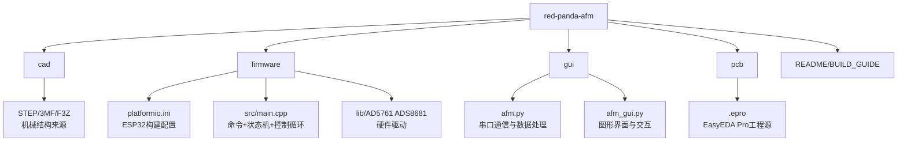

# 仓库目录逐个解释

## 这一页是干什么的
这一页把仓库目录变成“任务分解图”。你读完后，不只是知道目录名，而是知道每个目录该怎么读、读完要产出什么。

## 你会学到什么
- 每个目录的实现内容和作用
- 每个目录应该提取的关键信息
- “先读什么、后读什么”的执行顺序

## 先决条件
- [[03-仓库阅读与信息提取/01-先读README和BUILD_GUIDE]]

## 预计耗时
- 60~90 分钟

## 正文

## 仓库梳理图（结构图）

## 每个目录“实现内容 + 作用 + 你该做什么”
| 目录 | 实现内容 | 在系统中的作用 | 你要提取什么 |
|---|---|---|---|
| `cad/` | `.step/.3mf/.f3z` + 结构截图 | 机械结构与装配基础 | 零件关系、试打顺序、公差风险 |
| `firmware/` | ESP32 控制代码 + 驱动库 | 下位机实时控制、采样、扫描 | 命令协议、状态机、控制循环 |
| `gui/` | Python + PyQt6 上位机 | 人机交互、串口通信、数据可视化 | 按钮到命令的数据链路 |
| `pcb/` | EasyEDA Pro `.epro` 工程 | 电路原理图与 PCB 设计源 | 是否能导出 BOM/Gerber/PnP |
| 文档区 | README/BUILD_GUIDE | 项目背景、流程提示、安全提醒 | 事实与缺口分离 |

## 需要准备什么
- 代码编辑器（VSCode）
- 一个终端（会用 `rg --files`）
- Obsidian 记录页

## 一步一步怎么做
1. 先列出顶层目录：确认 `cad/firmware/gui/pcb` 都存在。
2. 逐个目录执行“只提取三件事”：
   - 实现了什么
   - 依赖什么
   - 对复现有什么约束
3. 把每个目录的“下一步动作”写成一句话任务。

## 每一步完成后怎么检查
- 你是否能回答“这个目录不看会卡在哪”？
- 每个目录是否都有至少一个“可执行下一步”？

## 出错时先看哪里
- 看不懂 `.epro`：去 [[03-仓库阅读与信息提取/06-pcb目录怎么读]]
- 看不懂 `main.cpp`：去 [[03-仓库阅读与信息提取/04-firmware目录怎么读]]
- 看不懂 `afm.py`：去 [[03-仓库阅读与信息提取/05-gui目录怎么读]]

## 暂时做不到也没关系的部分
- 不需要现在就理解每一行 C++/Python
- 不需要现在就导出完整生产文件

## 用最简单的话再说一遍
目录不是摆设。每个目录都对应一个复现环节，不读清楚就会在后面付出更大代价。

## 在 red-panda-afm 项目里它对应什么
- `red-panda-afm/cad/`
- `red-panda-afm/firmware/`
- `red-panda-afm/gui/`
- `red-panda-afm/pcb/`

## 这一页完成后，你应该能做到什么
- 画出仓库模块图
- 说清每个目录的输入输出
- 给自己列出下一步阅读顺序

## 常见误区
- 把仓库当“资料堆”，不做结构化提取
- 只看自己熟悉的目录，忽略系统耦合

## 下一页
- [[03-仓库阅读与信息提取/03-cad目录怎么读]]
- [[03-仓库阅读与信息提取/04-firmware目录怎么读]]
- [[03-仓库阅读与信息提取/05-gui目录怎么读]]
- [[03-仓库阅读与信息提取/06-pcb目录怎么读]]

## 导航
- 上一页：[[03-仓库阅读与信息提取/01-先读README和BUILD_GUIDE]]
- 下一页：[[03-仓库阅读与信息提取/03-cad目录怎么读]]
- 返回首页：[[00-首页/00-首页]]
