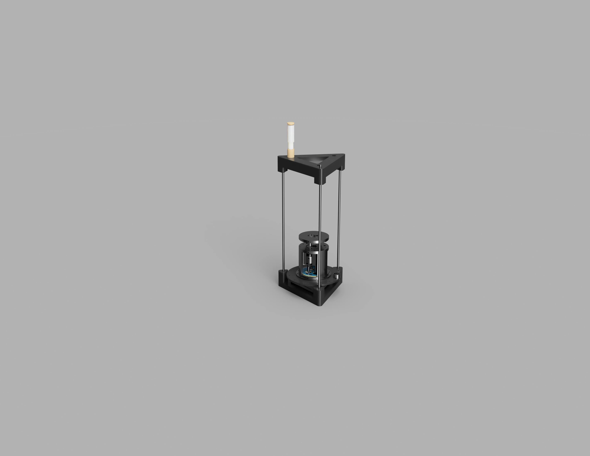
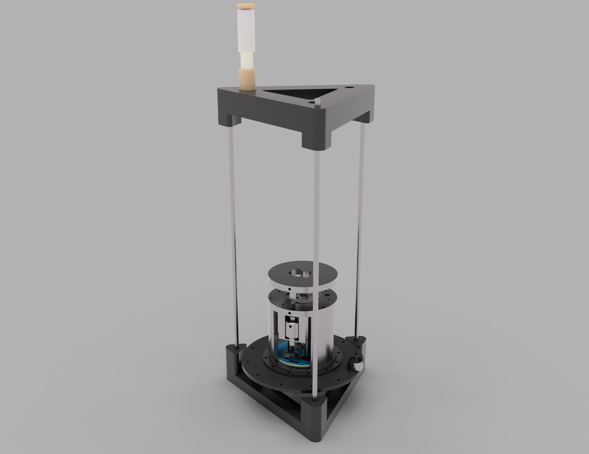
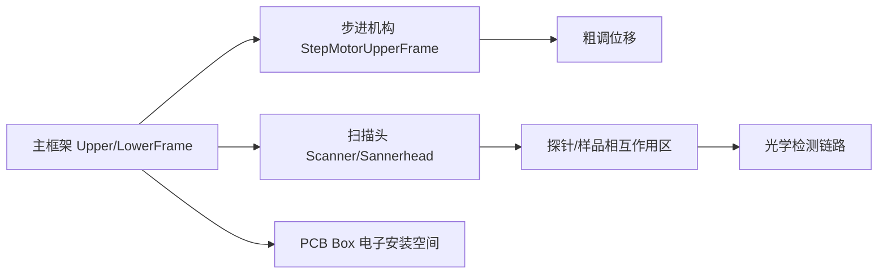

# cad目录怎么读

## 这一页是干什么的
这一页讲“怎么把机械文件读成装配计划”。目标是避免新手最常见错误：一次性全打、全装，然后大量返工。

## 你会学到什么
- `step / 3mf / f3z` 在项目里的实际用途
- 如何从零件名推断功能分组
- 如何用“先试装再扩展”降低机械风险

## 先决条件
- [[03-仓库阅读与信息提取/02-仓库目录逐个解释]]
- [[08-机械与3D打印部分/03-step-3mf-f3d分别是什么]]

## 预计耗时
- 60~120 分钟

## 正文

## 目录里有什么（已确认）
- `red-panda-afm/cad/afm/` 有大量 `.step` 文件（机械交换格式）
- 有 `Sannerhead.3mf`（打印工程格式）
- 有 `AFM v1.f3z`（Fusion 360 归档）
- 有扫描台视角截图 PNG（可用作结构理解）

## 可视化参考图（仓库自带）

## 机械结构功能梳理图（概念）

## 需要准备什么
- 一个可看 STEP 的软件（Fusion 360 / FreeCAD 任意）
- 一张“零件分组表”记录页

## 一步一步怎么做
1. 先按文件名分组，不直接打印：
   - 框架类：`UpperFrame/LowerFrame/PlatformPillar`
   - 运动类：`StepMotor* / Shaft / Spring*`
   - 扫描头类：`Scanner / Sannerhead / ProbeHolder*`
   - 安装盒类：`PCB_Box/*`
2. 用 STEP 查看关键配合面：孔位、槽位、导向面。
3. 只选“第一批关键件”试打（用于验证装配逻辑）。
4. 试装并记录：太紧/太松/干涉/形变。
5. 修正后再扩大打印范围。

## 每一步完成后怎么检查
- 你是否知道哪几个零件决定装配基准？
- 试装时是否能顺利完成“空装配闭环”？
- 你是否有返工记录，而不是只凭感觉改参数？

## 出错时先看哪里
- 孔位不对：先看单位和缩放设置
- 装不进去：先看公差，不要硬压
- 结构晃动：先看配合和锁紧顺序

## 暂时做不到也没关系的部分
- 不必一次做完整外观优化
- 不必第一轮追求“最终材料+最终参数”

## 原理解释（为什么先小批）
AFM 对稳定性非常敏感。机械误差会放大成信号噪声。先小批试装的本质，是把“低成本错误”留在前面，把“高成本错误”挡在后面。

## 用最简单的话再说一遍
先看懂结构、先少量试打、先空装验证，再全量打印。这就是机械复现最省钱的路线。

## 在 red-panda-afm 项目里它对应什么
- `red-panda-afm/cad/afm/*.step`
- `red-panda-afm/cad/afm/Sannerhead.3mf`
- `red-panda-afm/cad/afm/AFM v1.f3z`

## 这一页完成后，你应该能做到什么
- 能按功能分组 CAD 文件
- 能制定第一批试打计划
- 能解释为什么不能一次性全量打印

## 常见误区
- 文件一多就慌，直接全部打印
- 只看外观，不看装配关系
- 不记录返工原因

## 下一页
- [[03-仓库阅读与信息提取/04-firmware目录怎么读]]
- [[08-机械与3D打印部分/04-第一批建议先打印哪些件]]

## 导航
- 上一页：[[03-仓库阅读与信息提取/02-仓库目录逐个解释]]
- 下一页：[[03-仓库阅读与信息提取/04-firmware目录怎么读]]
- 返回首页：[[00-首页/00-首页]]
