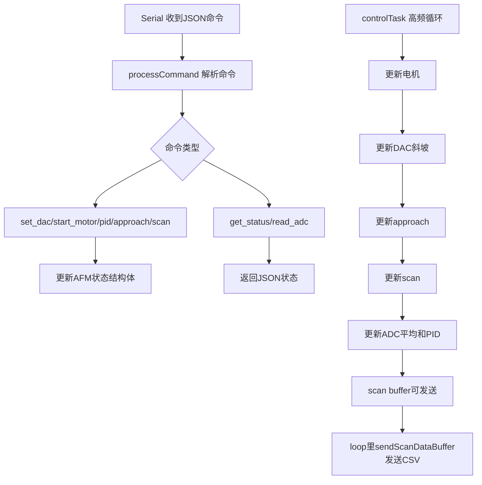
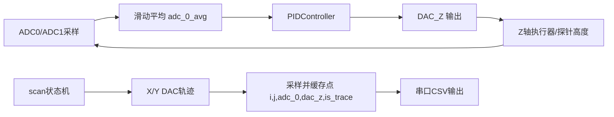

# firmware目录怎么读

## 这一页是干什么的
这一页把 `firmware` 读成“控制系统说明书”。你会看懂：固件接收什么命令、内部怎么跑状态机、扫描数据怎么吐给 GUI。

## 你会学到什么
- `platformio.ini` 和 ESP32 构建关系
- `main.cpp` 的核心控制循环原理
- 关键命令协议（JSON）和返回结构
- 扫描数据为何是 CSV 流 + JSON 完成信号

## 先决条件
- [[03-仓库阅读与信息提取/02-仓库目录逐个解释]]
- [[06-软件环境搭建/06-安装PlatformIO]]

## 预计耗时
- 2~3 小时

## 正文

## 已确认的关键事实
- 平台配置：`platformio.ini` 使用 `esp32doit-devkit-v1`，`monitor_speed = 115200`。
- 固件主文件：`src/main.cpp`。
- 系统状态：`IDLE / FOCUSING / APPROACHING / SCANNING`。
- 控制循环在 `controlTask()` 中执行：`updateMotorMovement -> updateDacRamp -> updateApproach -> updateScan -> updateAFMState -> updatePIDControl`。

## 固件控制流程图

## 固件“功能原理图”（概念）

## 命令协议速查（从 `processCommand` 提取）
| 命令 | 关键参数 | 作用 | 典型返回 |
|---|---|---|---|
| `reset` | 无 | 重置设备状态 | `status=success` |
| `restore` | 无 | 恢复状态 | `status=success` |
| `get_status` | 无 | 返回全量状态（ADC/DAC/电机/状态机） | `status=success` + 状态字段 |
| `set_dac` | `channel,value` | 设置 F/T/X/Y/Z DAC | `success/error` |
| `start_motor` | `motor,steps,direction,delay` | 启动步进 | `status=started` |
| `stop_motor` | 无 | 停止步进 | `stopped/idle` |
| `pid_control` | `action` + 参数 | PID 开关/参数设置/读状态 | `success/error` |
| `approach` | `action=start/stop/get_data` | 逼近流程控制 | `started/stopping/success` |
| `scan` | `action=start/stop/get_data` + 扫描参数 | 启停扫描和状态查询 | `started/stopped/...` |
| `set_adc_avg_window` | `window_size` | 设置 ADC 平均窗口 | `success/error` |
| `set_dac_range` | `range=10V/3V` | 设置 X/Y DAC 量程 | `success/error` |

## 为什么扫描数据是 CSV，不全是 JSON？
- JSON 适合命令和状态，语义清晰。
- 扫描数据点很多，逐点 JSON 开销大。
- 该项目采用“CSV 行流”输出点数据，最后再发一条 `{"command":"scan","status":"complete"}` JSON 表示结束。

## 需要准备什么
- 能打开 `main.cpp` 的编辑器
- 一张“命令-参数-返回”记录表

## 一步一步怎么做
1. 先读 `platformio.ini`，确认板型、串口参数。
2. 再读 `main.cpp` 的 `processCommand`，整理命令协议。
3. 读 `controlTask` 和 `updateScan`，看扫描数据如何产生。
4. 对照 GUI 的调用逻辑（下一页）验证命令是否一致。

## 每一步完成后怎么检查
- 你能否手写一条合法 `scan start` 命令？
- 你知道 `scan complete` 是怎么触发的吗？
- 你能解释 `get_status` 返回哪些关键字段吗？

## 出错时先看哪里
- 命令失败：先看参数合法性和当前状态是否冲突
- 扫描不动：看 `scan_active`、`ramp_active`、`resolution`
- 数据不完整：看 `scan_buffer` 和串口读取逻辑

## 暂时做不到也没关系的部分
- 不需要现在就改 PID 参数
- 不需要现在就优化控制循环频率

## 用最简单的话再说一遍
固件就是“下位机控制中心”。你要先掌握它的命令语法和状态逻辑，后面 GUI 和调试才不会乱。

## 在 red-panda-afm 项目里它对应什么
- `red-panda-afm/firmware/platformio.ini`
- `red-panda-afm/firmware/src/main.cpp`
- `red-panda-afm/firmware/lib/AD5761/*`
- `red-panda-afm/firmware/lib/ADS8681/*`

## 这一页完成后，你应该能做到什么
- 能读懂核心命令协议
- 能解释扫描状态机和数据输出链路
- 能为后续联调准备“命令测试清单”

## 常见误区
- 只会编译，不会协议级调试
- 不看状态机就连续发命令
- 把 CSV 扫描流误认为错误输出

## 下一页
- [[03-仓库阅读与信息提取/05-gui目录怎么读]]
- [[11-固件部分/01-firmware项目总览]]

## 导航
- 上一页：[[03-仓库阅读与信息提取/03-cad目录怎么读]]
- 下一页：[[03-仓库阅读与信息提取/05-gui目录怎么读]]
- 返回首页：[[00-首页/00-首页]]
