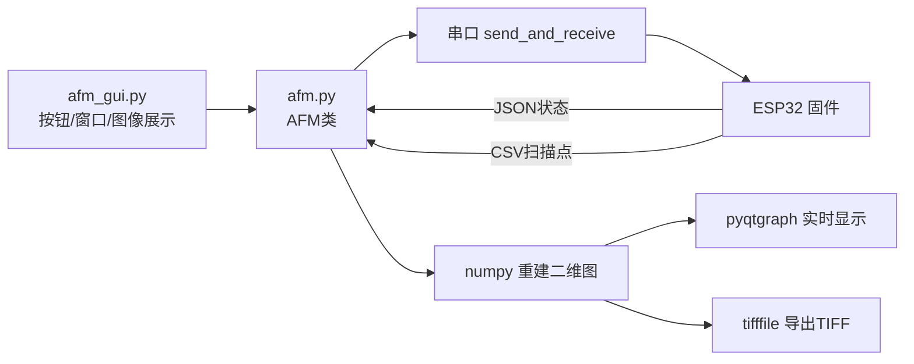
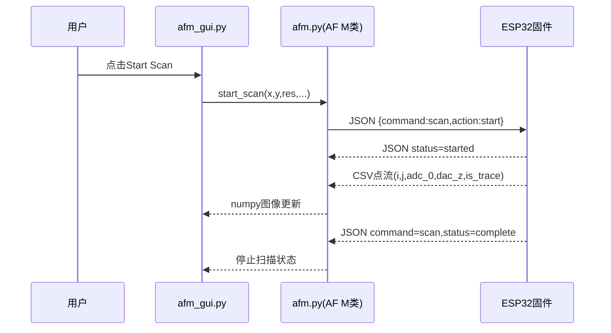

# gui目录怎么读

## 这一页是干什么的
这一页讲“上位机代码到底在做什么”。你读完后要能解释：按钮点下去发生了什么，数据怎么从串口变成图像，再怎么导出 TIFF。

## 你会学到什么
- `afm.py`（通信与业务）和 `afm_gui.py`（界面）如何分工
- 串口读取线程如何同时处理 JSON 与 CSV
- 扫描图像重建与 TIFF 导出的基本原理

## 先决条件
- [[03-仓库阅读与信息提取/04-firmware目录怎么读]]
- [[06-软件环境搭建/05-安装PyQt6等依赖]]

## 预计耗时
- 2~3 小时

## 正文

## 文件角色图

## 关键实现内容（已确认）
- 串口参数：`BAUDRATE = 115200`。
- `AFM.connect()` 建立串口并启动后台读取线程 `_serial_read_loop()`。
- 读取线程会区分：
  - 扫描 CSV 行：`i,j,adc_0,dac_z,is_trace`
  - JSON 响应：放入 `response_queue`
- `start_scan()` 发送 `scan start` 命令，并记录扫描范围与分辨率。
- `get_scan_image()` 根据索引重建二维矩阵。
- `export_tiff()` 支持 trace/retrace + ADC0/DACZ 导出，并输出 `scan_metadata.json`。

## 按钮到硬件的流程图（Focus/Approach/Scan）

## 需要准备什么
- 能运行 Python 的环境
- 读代码时能开两个窗口：`afm.py` 与 `afm_gui.py`

## 一步一步怎么做
1. 先读 `afm.py` 的 `connect/send_and_receive/_serial_read_loop`。
2. 再读 `start_scan/get_scan_image/export_tiff`。
3. 再读 `afm_gui.py` 的三个窗口类：Focus、Approach、Scan。
4. 最后把每个按钮对应的固件命令写成表格。

## 每一步完成后怎么检查
- 你是否知道扫描数据有 trace/retrace 两套？
- 你是否能说出 TIFF 导出前最小需要哪些数据？
- 你是否能定位“连不上串口”应该看哪层代码？

## 出错时先看哪里
- GUI 能开但不连设备：看 `connect()` 和串口端口选择
- 按钮无响应：看 `clicked.connect` 是否绑定到正确函数
- 有数据但图像空白：看 `scan_resolution`、索引映射和 NaN 比例

## 暂时做不到也没关系的部分
- 不需要先改 UI 美化
- 不需要先重构线程模型

## 原理解释（为什么分层）
`afm_gui.py` 负责“可视化交互”，`afm.py` 负责“设备协议和数据处理”。分层后，界面改动不会直接破坏通信核心，调试成本更低。

## 用最简单的话再说一遍
GUI 是操作面板，`afm.py` 是通信大脑。你先看懂这条链路，后面联调效率会高很多。

## 在 red-panda-afm 项目里它对应什么
- `red-panda-afm/gui/afm.py`
- `red-panda-afm/gui/afm_gui.py`
- `red-panda-afm/gui/ui/*.ui`

## 这一页完成后，你应该能做到什么
- 能画出 GUI->固件 的命令流程
- 能解释扫描数据从串口到图像的过程
- 能定位 GUI 层常见故障入口

## 常见误区
- 把 GUI 当成“黑盒软件”不读协议层
- 只看界面不看后台线程
- 导出失败时不看 metadata 和 NaN 统计

## 下一页
- [[03-仓库阅读与信息提取/06-pcb目录怎么读]]
- [[12-GUI与上位机部分/01-gui项目总览]]

## 导航
- 上一页：[[03-仓库阅读与信息提取/04-firmware目录怎么读]]
- 下一页：[[03-仓库阅读与信息提取/06-pcb目录怎么读]]
- 返回首页：[[00-首页/00-首页]]
