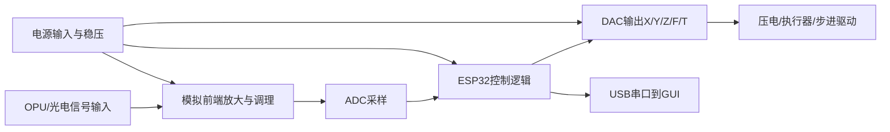

# pcb目录怎么读

## 这一页是干什么的
这一页讲“如何从 `.epro` 工程源反查电路信息”，并明确告诉你：现在有工程源，但不是完整生产交付包。

## 你会学到什么
- `.epro` 文件内部是什么结构
- 为什么 `.epro` 不能直接等价成 Gerber/BOM/PnP
- 如何一步一步导出并验证生产数据
- 如何做“原理图阅读”而不乱猜参数

## 先决条件
- [[03-仓库阅读与信息提取/02-仓库目录逐个解释]]
- [[07-PCB与电子部分/02-如何阅读pcb目录]]

## 预计耗时
- 初次梳理：2~4 小时

## 正文

## 目录现状（从文件扫描得到）
- `pcb/` 下可见：`ProPrj_red-panda-afm_2025-05-21.epro`
- 该文件是 ZIP 容器，可解出 EasyEDA Pro 工程对象

## epro 内部结构统计（已提取）
- 原理图文件（`.esch`）：8 个
- PCB 文件（`.epcb`）：4 个
- 符号文件（`.esym`）：108 个
- 去重后的元件标号（Designator）：136 个

## 标号前缀分布（去重）
- `C:47`、`R:39`、`U:18`、`H:5`、`SCREW:5`、`LED:4`
- 还包含 `StepperMotor`、`OPUData`、`PiezoData`、`FPC` 等接口类标号

## 从 epro 自动提取到的器件线索（示例）
> [!warning]
> 下表是“符号映射线索”，不是完整 BOM。仅用于帮助你定位原理图，不可直接下单。

| 标号 | 线索（符号映射到的 Part） | 用途判断（需在原理图页继续确认） |
|---|---|---|
| `U1` | `LT1807IS8#PBF` | 高速运放相关链路（待确认） |
| `U5/U6/U7` | `OPA2227UA` | 精密运放相关链路（待确认） |
| `U10` | `LM7905T` | 负压稳压相关链路（待确认） |
| `U12` | `AD8397ARZ-REEL7` | 放大/驱动相关链路（待确认） |
| `CN1` | `ZX-XH2.54-3PZZ` | 接插件类 |
| `FPC1/PiezoFPC1` | `AFC01-S24FCA-00` | FPC 接口类 |

## 原理图（两层理解）

### 1) 功能原理图（概念层，先建立系统认知）

### 2) 工程原理图（可生产层）
- 在 EasyEDA Pro 中打开 `.epro` 才能看到完整多页原理图。
- 本仓库中未直接提供“导出的原理图 PDF + Gerber + BOM + PnP”成套文件（需你自己导出并核对）。

## 需要准备什么
- EasyEDA Pro
- 一份导出检查表（BOM/Gerber/PnP/层叠/单位）

## 一步一步怎么做
1. 在 EasyEDA Pro 打开 `.epro` 工程。
2. 逐页检查 `.esch`：先看电源、接口、核心芯片、模拟链路。
3. 导出 BOM（CSV）并检查是否有空值/占位字段。
4. 导出 Gerber 与 PnP，检查层命名和原点设置。
5. 做版本归档：记录导出时间、软件版本、工程 hash。

## 每一步完成后怎么检查
- BOM 是否能对应到 Designator？
- Gerber 层是否齐全（铜层/阻焊/丝印/钻孔）？
- PnP 是否有坐标和旋转角？

## 出错时先看哪里
- 导出失败：先确认 EasyEDA Pro 版本与工程兼容
- BOM 缺字段：先看符号属性是否是占位变量
- PnP 坐标异常：先看原点、单位、镜像面设置

## 暂时做不到也没关系的部分
- 不必第一天就把所有元件型号完全锁定
- 不必立刻下单，先把导出闭环跑通

## 原理解释（为什么这一页很关键）
复现里最容易“高成本返工”的环节是 PCB：一旦误下单，时间和预算都损失。先验证工程可导出性，是为了把风险前置。

## 用最简单的话再说一遍
你现在拿到的是“工程源”，不是“工厂包”。先导出、再核对、最后再考虑下单。

## 在 red-panda-afm 项目里它对应什么
- `red-panda-afm/pcb/ProPrj_red-panda-afm_2025-05-21.epro`

## 这一页完成后，你应该能做到什么
- 能解释 `.epro` 的定位
- 能执行一次完整的导出验证流程
- 能列出目前仍缺哪些生产级资料

## 常见误区
- 把 `.epro` 当 Gerber 直接发工厂
- 不验证坐标/原点就导出 PnP
- 不记录导出版本，后面无法追溯

## 下一页
- [[03-仓库阅读与信息提取/07-仓库里已经明确的信息]]
- [[17-待确认与工程补全/02-PCB输出文件待确认]]

## 导航
- 上一页：[[03-仓库阅读与信息提取/05-gui目录怎么读]]
- 下一页：[[03-仓库阅读与信息提取/07-仓库里已经明确的信息]]
- 返回首页：[[00-首页/00-首页]]
