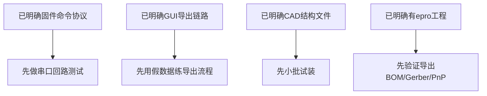

# 仓库里已经明确的信息

## 这一页是干什么的
这一页把“确定事实”集中列出，避免你把猜测当事实。所有结论都尽量能在仓库文件里找到对应证据。

## 你会学到什么
- 哪些信息已经足够支撑下一步
- 哪些结论是“代码级证据”，不是口头判断
- 如何把事实直接转换为复现动作

## 先决条件
- [[03-仓库阅读与信息提取/01-先读README和BUILD_GUIDE]]
- [[03-仓库阅读与信息提取/06-pcb目录怎么读]]

## 预计耗时
- 30~45 分钟

## 正文

## 已明确事实总览
| 类别 | 已明确事实 | 证据文件 |
|---|---|---|
| 项目定位 | 开源 AFM，强调低成本 DIY | `README*` |
| 仓库结构 | 有 `cad/firmware/gui/pcb` 四大模块 | 仓库顶层目录 |
| 固件平台 | PlatformIO + ESP32 (`esp32doit-devkit-v1`) | `firmware/platformio.ini` |
| 串口参数 | 监视器速率 `115200` | `firmware/platformio.ini` |
| 固件状态机 | `IDLE/FOCUSING/APPROACHING/SCANNING` | `firmware/src/main.cpp` |
| 固件协议 | JSON 命令 + JSON 状态 + CSV 扫描流 | `firmware/src/main.cpp` |
| GUI技术栈 | Python + PyQt6 + pyqtgraph + pyserial + numpy + tifffile | `gui/afm.py`、`gui/afm_gui.py` |
| GUI功能 | Focus / Approach / Scan / TIFF 导出 | `gui/afm.py`、`gui/afm_gui.py` |
| PCB工程 | EasyEDA Pro `.epro` 工程存在 | `pcb/ProPrj_*.epro` |
| PCB内部规模 | 8 `.esch`、4 `.epcb`、108 `.esym`（解包统计） | `.epro` 解包结果 |
| CAD资料 | step/3mf/f3z 多格式并存 | `cad/afm/` |

## 这些事实对复现有什么直接作用
- 可以先走通“软件链路”（GUI 与固件协议），不必立刻焊板。
- 可以先做机械试装策略（从 `cad` 入手），不必立刻全量打印。
- 可以先做 PCB 导出可行性验证，不盲目下单。

## 事实到行动映射图

## 用最简单的话再说一遍
你已经有足够多“硬证据”开始做准备工作，但还不足以闭眼采购和整机开工。

## 在 red-panda-afm 项目里它对应什么
- `red-panda-afm/README*`
- `red-panda-afm/firmware/platformio.ini`
- `red-panda-afm/firmware/src/main.cpp`
- `red-panda-afm/gui/afm.py`
- `red-panda-afm/gui/afm_gui.py`
- `red-panda-afm/pcb/ProPrj_red-panda-afm_2025-05-21.epro`
- `red-panda-afm/cad/afm/*`

## 这一页完成后，你应该能做到什么
- 能区分“已确认事实”与“还没证据的假设”
- 能基于事实安排下一步动作

## 常见误区
- 有一部分事实就误以为“全都清楚了”
- 不写证据路径，后面难以复查

## 下一页
- [[03-仓库阅读与信息提取/08-仓库里缺失的信息]]
- [[03-仓库阅读与信息提取/10-源码证据索引]]

## 导航
- 上一页：[[03-仓库阅读与信息提取/06-pcb目录怎么读]]
- 下一页：[[03-仓库阅读与信息提取/08-仓库里缺失的信息]]
- 返回首页：[[00-首页/00-首页]]
