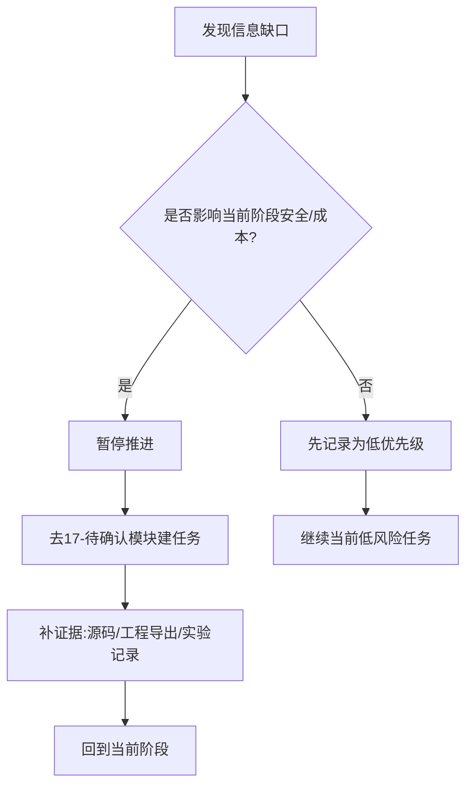

# 仓库里缺失的信息

## 这一页是干什么的
这一页告诉你：哪些信息当前仍不完整，以及这些缺口会怎样影响复现。目标是把风险说透，而不是让你“硬着头皮先做再说”。

## 你会学到什么
- 缺失信息的类型与影响等级
- 缺失信息的补齐路径
- 什么时候该暂停推进，先补资料

## 先决条件
- [[03-仓库阅读与信息提取/07-仓库里已经明确的信息]]

## 预计耗时
- 45~60 分钟

## 正文

## 缺口清单（带影响等级）
| 缺口项 | 当前状态 | 影响等级 | 不补会怎样 |
|---|---|---|---|
| 完整 BOM（可采购） | 未在仓库根目录直接给出 | 高 | 采购错误、预算失控 |
| Gerber 独立发布包 | 未见直接发布 | 高 | 无法直接打板或层文件错误 |
| Pick-and-Place | 未见直接发布 | 高 | SMT 工艺难推进 |
| 关键器件最终型号清单 | 仅能从工程片段反查 | 高 | 参数不匹配导致返工 |
| 详细装配公差说明 | 不完整 | 中 | 机械试装反复返工 |
| 光学对准细节步骤 | 文档偏概述 | 高 | 光路调试周期显著拉长 |
| 标准化性能验证流程 | 不完整 | 中 | 结果难比较、难复现 |

## 缺口补齐流程图

## 需要准备什么
- 待确认任务表
- 版本化记录习惯（每次导出都要写日期和来源）

## 一步一步怎么做
1. 把所有缺口逐条写进 [[03-仓库阅读与信息提取/09-待确认问题总表]]。
2. 给每条缺口打标签：高风险（必须先补）/中低风险（可并行）。
3. 对高风险缺口制定“补证据动作”：
   - 从 `.epro` 导出验证
   - 从源码反查字段
   - 从调试实验记录验证
4. 只有在高风险缺口满足最低条件时，才进入下一阶段。

## 每一步完成后怎么检查
- 高风险缺口是否有“证据链接 + 结论 + 日期”？
- 是否存在“没有证据就拍板采购”的行为？

## 出错时先看哪里
- 发现信息反复变化：先核对版本来源是否一致
- 导出文件不一致：先核对导出参数和工程版本

## 暂时做不到也没关系的部分
- 中低风险细节可以延后，不要卡死进度
- 先保证“安全 + 可运行”优先

## 用最简单的话再说一遍
资料不全是现实，不是你的错。关键是把缺口管起来，不让它在后面变成大坑。

## 在 red-panda-afm 项目里它对应什么
- 主要来自 `pcb/*.epro` 未直接配套完整制造输出
- 文档层面未给全流程工业级细节

## 这一页完成后，你应该能做到什么
- 能说清“哪些缺口必须先补”
- 能建立“先补证据再推进”的节奏

## 常见误区
- 想着“先做着看”，不建缺口清单
- 采购后才发现参数不匹配

## 下一页
- [[03-仓库阅读与信息提取/09-待确认问题总表]]
- [[17-待确认与工程补全/01-BOM待确认]]

## 导航
- 上一页：[[03-仓库阅读与信息提取/07-仓库里已经明确的信息]]
- 下一页：[[03-仓库阅读与信息提取/09-待确认问题总表]]
- 返回首页：[[00-首页/00-首页]]
