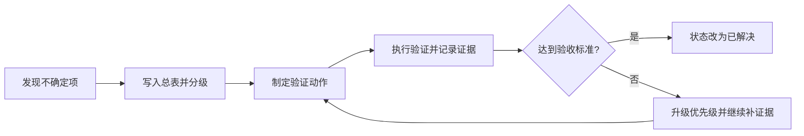

# 待确认问题总表

## 这一页是干什么的
这是你整个复现过程的“风险驾驶舱”。所有不确定项都要进这张表，带优先级、验证方法、阶段退出条件。

## 你会学到什么
- 如何把“我不确定”变成“可执行验证任务”
- 如何设置每个阶段的进入/退出条件
- 怎么防止项目卡在模糊地带

## 先决条件
- [[03-仓库阅读与信息提取/08-仓库里缺失的信息]]

## 预计耗时
- 首次建立：60 分钟
- 每次复查：10~20 分钟

## 正文

## 待确认总表（建议每周更新）
| 编号 | 问题 | 当前证据 | 风险等级 | 验证方法 | 验收标准 | 状态 |
|---|---|---|---|---|---|---|
| Q1 | 完整 BOM 是否可导出 | 仅有 `.epro` | 高 | EasyEDA 导出 BOM | 有 Designator/型号/封装且无关键空值 | 待办 |
| Q2 | Gerber 是否可直接下单 | 未见独立包 | 高 | 导出 Gerber 并做层检查 | 层齐全、钻孔正常、边框正确 | 待办 |
| Q3 | PnP 是否可用于贴片 | 未见独立包 | 高 | 导出坐标文件 | 含坐标/角度/面别/参考原点 | 待办 |
| Q4 | 关键芯片型号是否完整 | 部分可由符号映射得到 | 高 | 从 esym + 原理图双重核对 | 核心 U 器件型号可追溯 | 进行中 |
| Q5 | 光学链路对准步骤是否完整 | 文档概述 | 高 | 建立小步调参实验记录 | 有可复用操作顺序和判据 | 待办 |
| Q6 | 机械公差是否足够 | CAD有、公差说明不足 | 中 | 首批试打空装配验证 | 基准件可顺利装配、无严重干涉 | 待办 |
| Q7 | 性能验证流程是否明确 | 文档泛化描述 | 中 | 制定标准测试模板 | 有样品、参数、噪声记录模板 | 待办 |

## 阶段退出条件（很关键）

### 从“读仓阶段”进入“采购阶段”的条件
- Q1、Q2 至少完成初版验证。
- Q4 至少完成核心器件链路的型号核对。
- 仍不满足时：暂停采购，继续补证据。

### 从“采购阶段”进入“焊接/装配阶段”的条件
- 关键器件型号不再冲突。
- PCB 导出文件经过至少一次可视化检查。

### 从“装配阶段”进入“联调阶段”的条件
- 机械空装配通过。
- 上电前检查清单完成。

## 待确认闭环流程图

## 需要准备什么
- 一份固定模板（可用 [[18-模板与记录/03-问题记录模板]]）
- 证据文件路径或截图

## 一步一步怎么做
1. 每个问题必须写“验证方法”和“验收标准”。
2. 不允许只写“待确认”四个字。
3. 每次验证后都更新状态与日期。

## 每一步完成后怎么检查
- 是否每个高风险问题都有明确截止动作？
- 是否出现“久拖不决但继续推进硬件”的情况？

## 出错时先看哪里
- 推进卡住：看是不是高风险项没闭环却强行推进
- 反复返工：看是否缺少“验收标准”

## 暂时做不到也没关系的部分
- 低风险项可以后置，但必须记录

## 用最简单的话再说一遍
这张表是你的项目刹车和方向盘。没有它，复现很容易失控。

## 在 red-panda-afm 项目里它对应什么
- 来自 `README/BUILD_GUIDE/cad/firmware/gui/pcb` 全部来源的综合待确认项

## 这一页完成后，你应该能做到什么
- 能给每个不确定问题定义“怎么确认才算完成”
- 能判断是否该进入下一阶段

## 常见误区
- 只有问题没有验收标准
- 只更新“状态”，不写证据

## 下一页
- [[04-复现总计划/01-总阶段划分]]
- [[17-待确认与工程补全/01-BOM待确认]]

## 导航
- 上一页：[[03-仓库阅读与信息提取/08-仓库里缺失的信息]]
- 下一页：[[04-复现总计划/01-总阶段划分]]
- 返回首页：[[00-首页/00-首页]]
