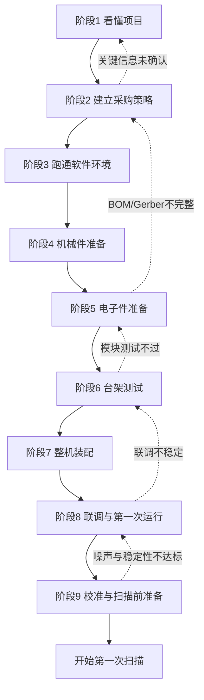

# 总阶段划分

## 这一页是干什么的
这是你的“总作战图”。把复现拆成 9 个阶段 + 1 个持续迭代阶段，每阶段都有进入条件、退出条件、失败回退动作。

## 你会学到什么
- 复现全过程的顺序和节奏
- 每个阶段的输入/输出/验收标准
- 卡住时如何回退，不让项目失控

## 先决条件
- [[03-仓库阅读与信息提取/00-本模块总览与使用方法]]
- [[03-仓库阅读与信息提取/09-待确认问题总表]]

## 预计耗时
- 首次制定：60~90 分钟
- 每周复盘：20 分钟

## 正文

## 全流程路线图（含回退机制）

## 分阶段总表（执行版）
| 阶段 | 目标 | 输入 | 输出 | 退出条件（必须满足） |
|---|---|---|---|---|
| 1 看懂项目 | 形成正确问题地图 | 仓库 + 知识库 | 已确认/待确认列表 | 能解释系统链路，完成待确认表初版 |
| 2 建采购策略 | 防止盲买 | 阶段1输出 | 三层采购清单 | 高风险项（BOM/Gerber/关键器件）有确认路径 |
| 3 软件环境 | 先跑通软链路 | 电脑与开发工具 | 固件可编译、GUI可启动 | 环境验证清单通过 |
| 4 机械准备 | 先试装后全量 | CAD文件 | 首批试装件 + 干涉记录 | 关键配合位可重复装配 |
| 5 电子准备 | 可安全上电 | epro工程 + 工具 | BOM草案 + 焊接完成 + 上电前检查 | 无明显短路风险，关键点检查通过 |
| 6 台架测试 | 模块逐个测通 | 板级系统 | 通信/电机/DAC/ADC/光学单测记录 | 各模块可独立复现 |
| 7 整机装配 | 可维护整机 | 模块通过结果 | 完整装配与走线 | 结构稳定、走线不干涉 |
| 8 联调首跑 | 系统协同可控 | 整机 | 首次联调记录 | 可重复得到可解释信号 |
| 9 校准准备 | 满足扫描前门槛 | 联调结果 | 校准与稳定性记录 | 达到首次扫描前条件 |
| 10 持续迭代 | 提高成功率 | 全流程日志 | 参数版本与改进闭环 | 每轮改动可追溯、有对照测试 |

## 全局硬门槛（未满足时禁止进入首次扫描）
- [ ] `P0` 协议一致性问题已确认处理（`speed/delay` 字段统一）
- [ ] GUI 忙状态逻辑检查通过（避免状态误判）
- [ ] ADC 型号一致性完成双确认（工程/实物/驱动）

## 需要准备什么
- [[18-模板与记录/01-每日学习记录模板]]
- [[18-模板与记录/06-调试日志模板]]
- [[03-仓库阅读与信息提取/09-待确认问题总表]]

## 一步一步怎么做
1. 先把你当前状态定位到一个阶段（不要跨级）。
2. 对当前阶段写“本周最小目标”（1~3条）。
3. 每天记录“做了什么 + 证据 + 下一步”。
4. 达到退出条件才进入下一阶段。

## 每一步完成后怎么检查
- 你是否能给出“证据文件路径”？
- 你是否有清晰的“下一步动作”？
- 你是否在用回退机制而不是硬扛？

## 出错时先看哪里
- 范围失控：回到阶段表，砍掉并行任务
- 连续失败：检查是否跨阶段推进
- 预算失控：回到阶段2重新冻结采购

## 暂时做不到也没关系的部分
- 不必追求一次性做到“高质量扫描图”
- 先保证系统逻辑跑通，再谈性能极限

## 用最简单的话再说一遍
把复现当“闯关游戏”：每关有标准，不过关不硬闯，卡住就回退。

## 在 red-panda-afm 项目里它对应什么
- 贯穿 `README/BUILD_GUIDE/cad/firmware/gui/pcb` 全链路

## 这一页完成后，你应该能做到什么
- 明确自己当前在哪一阶段
- 知道本周最该做什么
- 有一套可执行回退机制

## 常见误区
- 并行开太多线
- 不设退出条件
- 失败后不复盘直接重复

## 下一页
- [[04-复现总计划/02-第一阶段 先学会看懂项目]]
- [[04-复现总计划/11-复现闭环与反复迭代机制]]
- [[04-复现总计划/12-跨阶段硬门槛验收清单]]

## 导航
- 上一页：[[03-仓库阅读与信息提取/09-待确认问题总表]]
- 下一页：[[04-复现总计划/02-第一阶段 先学会看懂项目]]
- 返回首页：[[00-首页/00-首页]]
