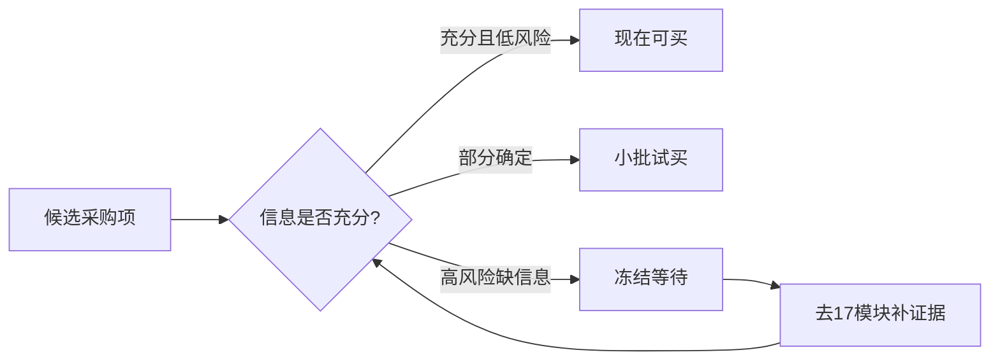

# 第二阶段 建立采购清单

## 这一页是干什么的
把采购从“拍脑袋”变成“分阶段、分风险、可追溯”的工程动作。

## 你会学到什么
- 三层采购策略（现在买/小批买/冻结等待）
- 如何避免预算失控
- 如何把待确认问题和采购动作绑定

## 先决条件
- [[04-复现总计划/02-第一阶段 先学会看懂项目]]
- [[17-待确认与工程补全/01-BOM待确认]]

## 预计耗时
- 2~5 天

## 正文

## 采购策略图

## 需要准备什么
- [[18-模板与记录/02-采购记录模板]]
- [[05-采购与预算/07-预算分级方案]]
- [[03-仓库阅读与信息提取/09-待确认问题总表]]

## 一步一步怎么做
1. 把采购项分为三层：
   - 可立即采购：通用工具/耗材/低耦合部件
   - 小批试购：需要验证接口或性能的部件
   - 冻结等待：核心器件（需 BOM/Gerber/参数确认）
2. 每项必须写：用途、来源证据、风险等级、替代方案。
3. 先冻结高风险项预算，不提前透支。
4. 每次确认一项，立刻更新采购状态。

## 每一步完成后怎么检查
- 是否存在“无证据但高金额采购”？
- 是否有“关键器件型号仍冲突”？
- 预算是否分层（必须/可选/延期）？

## 出错时先看哪里
- 采购冲动：先看 [[05-采购与预算/04-哪些信息目前还不能确定]]
- 型号冲突：回到 [[17-待确认与工程补全/03-关键器件型号待确认]]

## 暂时做不到也没关系的部分
- 高风险器件可以先不买
- 先把“可立即推进”的准备项做完

## 阶段退出条件（必须满足）
- [ ] 完成三层采购清单
- [ ] 高风险冻结项均有“补证据动作”
- [ ] 预算分级明确并可执行

## 用最简单的话再说一遍
采购不是越快越好，而是越稳越好。先管风险，再花钱。

## 在 red-panda-afm 项目里它对应什么
- `pcb/*.epro` 导出能力
- `firmware/gui` 对关键器件的约束
- `cad` 对机械件的约束

## 这一页完成后，你应该能做到什么
- 拿到一份低风险可执行采购计划

## 常见误区
- 一次性买齐核心器件
- 不做替代方案

## 下一页
- [[04-复现总计划/04-第三阶段 完成软件环境]]

## 导航
- 上一页：[[04-复现总计划/02-第一阶段 先学会看懂项目]]
- 下一页：[[04-复现总计划/04-第三阶段 完成软件环境]]
- 返回首页：[[00-首页/00-首页]]
