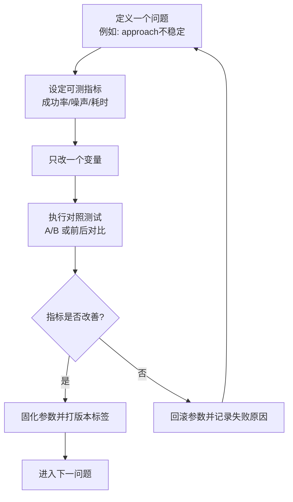

# 复现闭环与反复迭代机制

## 这一页是干什么的
你说的“反复推”就落在这页：定义一套稳定的迭代闭环，让复现成功率持续提高，而不是盲试。

## 你会学到什么
- 一轮迭代该怎么做
- 每轮要产出哪些证据
- 什么时候判定“有效改进”

## 先决条件
- [[04-复现总计划/01-总阶段划分]]

## 预计耗时
- 每轮 1~3 天（按问题复杂度）

## 正文

## 迭代闭环图

## 需要准备什么
- [[18-模板与记录/06-调试日志模板]]
- [[18-模板与记录/07-里程碑检查模板]]

## 一步一步怎么做
1. 只选一个问题，不并行乱改。
2. 定义 1~3 个可量化指标。
3. 每轮只改 1 个参数。
4. 对照测试并写结论。
5. 有效则固化，无效则回滚。

## 建议优先迭代顺序（先硬阻塞后优化）
1. 协议一致性（命令字段与返回状态）
2. 关键器件一致性（工程/固件/实物）
3. 生产文件可导出性（Gerber/BOM/CPL）
4. 光学和机械稳定性优化

## 每一步完成后怎么检查
- 是否有“改前/改后”数据
- 是否有版本号和时间戳
- 是否能复现改进结果

## 出错时先看哪里
- 结果不稳定：检查是否一次改了多个变量
- 记录缺失：先补日志再继续

## 暂时做不到也没关系的部分
- 没有高级仪器也能先做相对对比

## 用最简单的话再说一遍
反复推进不是重复试错，而是“每轮都可回溯、可比较、可积累”。

## 在 red-panda-afm 项目里它对应什么
- 全阶段通用方法，尤其适用于 `approach/scan/光学调试`

## 这一页完成后，你应该能做到什么
- 建立一套长期可持续的调试方法

## 常见误区
- 每轮改太多
- 不做对照测试
- 失败不记录

## 下一页
- [[04-复现总计划/12-跨阶段硬门槛验收清单]]
- [[14-调试与联调/01-为什么要分模块调试]]
- [[20-路线收尾/01-你已经走到哪一步了]]

## 导航
- 上一页：[[04-复现总计划/10-第九阶段 校准与第一次扫描前准备]]
- 下一页：[[04-复现总计划/12-跨阶段硬门槛验收清单]]
- 返回首页：[[00-首页/00-首页]]
