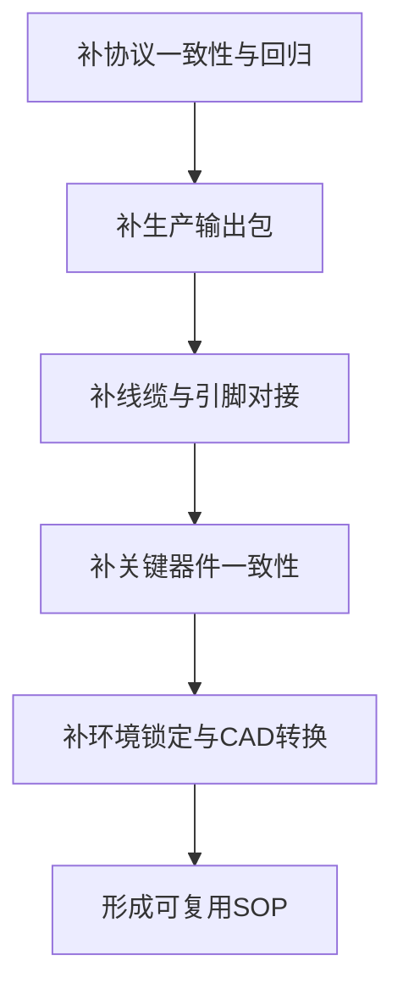

# 缺失信息总览与补全路线

## 这一页是干什么的
把“缺失信息”从抽象风险变成可执行任务。你可以把这页当作补全工作的总控台。

## 你会学到什么
- 目前哪些信息已经补到哪一步
- 哪些缺口仍会阻碍复现
- 补全优先级和执行顺序

## 先决条件
- [[03-仓库阅读与信息提取/09-待确认问题总表]]

## 预计耗时
- 首次建立：45 分钟
- 每周更新：15 分钟

## 正文

## 当前补全进度（基于仓库可提取信息）
- 已补：
  - `.epro` 内部结构统计（`esch/epcb/esym`）
  - 去重 Designator 列表（136 项）
  - 可映射 Part 线索（63 项）
  - 协议风险清单（`speed/delay`、`stopping/stopped`、`is_busy`）
  - 连接器网络名初版对照
- 仍缺：
  - 官方可直接下单的完整 BOM/Gerber/Drill/CPL
  - 连接器最终针脚线序（含 Pin1 方向）
  - ADC 型号三方一致性最终确认
  - 可打印 STL 批量资产或统一转换包

## 复现阻塞项分级（必须先处理）

### P0（不处理会直接影响实验复现）
1. 协议字段一致性（`speed/delay`）。
2. `approach stop` 状态语义一致性（`stopping/stopped`）。
3. GUI 忙状态调用逻辑（`is_busy`）。
4. ADC 型号一致性（工程/驱动/实物）。
5. PCB 生产输出包可用性（4 块板均可导出）。
6. 线缆与引脚对接表完成度（至少到可上电复核）。

### P1（不处理会明显拖慢复现）
1. GUI 环境版本锁定不足。
2. CAD 打印资产链路（STEP->STL）未标准化。
3. 光学链路与装配公差信息不完整。

## 关键证据文件
- [[assets/17-待确认与工程补全/epro提取摘要]]
- `assets/17-待确认与工程补全/epro_器件线索_去重.csv`
- `red-panda-afm/firmware/src/main.cpp`
- `red-panda-afm/gui/afm.py`
- `red-panda-afm/gui/afm_gui.py`

## 补全优先级路线图

## 需要准备什么
- [[18-模板与记录/03-问题记录模板]]
- [[18-模板与记录/06-调试日志模板]]

## 一步一步怎么做
1. 先做 `P0`，不跨级。
2. 每补一项都写证据路径和日期。
3. 每周复盘一次，更新优先级。
4. 未完成 `P0` 前，不进入首次扫描。

## 每一步完成后怎么检查
- 是否有“明确证据”而不是口头结论？
- 是否明确“下一步动作”？

## 出错时先看哪里
- 反复卡住：检查是否跳过了 `P0`
- 记录混乱：回到模板页重新整理

## 暂时做不到也没关系的部分
- P1/P2 项可延后
- 先保系统跑通

## 用最简单的话再说一遍
先补能不能做下去的信息，再补做得更好的信息。

## 在 red-panda-afm 项目里它对应什么
- `red-panda-afm/pcb/ProPrj_red-panda-afm_2025-05-21.epro`
- `red-panda-afm/firmware/*`
- `red-panda-afm/gui/*`
- `red-panda-afm/cad/*`

## 这一页完成后，你应该能做到什么
- 清楚知道下一周该补哪类信息
- 不会在低优先级问题上消耗主线进度

## 常见误区
- 缺口很多但没有优先级
- 只记问题，不记证据和动作

## 下一页
- [[17-待确认与工程补全/01-BOM待确认]]
- [[17-待确认与工程补全/08-协议一致性与回归清单]]
- [[17-待确认与工程补全/09-线缆与引脚对接表]]

## 导航
- 上一页：[[03-仓库阅读与信息提取/09-待确认问题总表]]
- 下一页：[[17-待确认与工程补全/01-BOM待确认]]
- 返回首页：[[00-首页/00-首页]]
