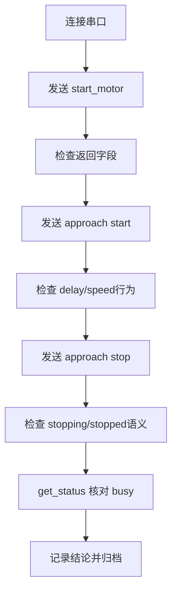

# 协议一致性与回归清单

## 这一页是干什么的
把“协议可能有问题”变成可执行的排查和回归清单，重点覆盖 `speed/delay`、`stopping/stopped`、`is_busy` 三个阻塞点。

## 你会学到什么
- 哪些字段目前存在不一致风险
- 怎么做最小回归测试
- 怎么判断“可以继续复现”

## 先决条件
- [[03-仓库阅读与信息提取/10-源码证据索引]]
- [[12-GUI与上位机部分/02-afm.py在做什么]]
- [[11-固件部分/01-firmware项目总览]]

## 预计耗时
- 首轮核对：1~2 小时
- 每次修改后回归：20~30 分钟

## 正文

## 已确认的协议风险（基于源码）
| 风险项 | GUI侧线索 | 固件侧线索 | 风险结论 |
|---|---|---|---|
| `speed` vs `delay` | `approach/start_motor` 发送 `speed` | `processCommand` 读取 `delay` | 高风险：参数可能被忽略或默认化 |
| `stopping` vs `stopped` | `stop_approach` 期待 `stopped` | `approach stop` 返回 `stopping` | 中高风险：GUI状态可能误判 |
| `is_busy` 调用方式 | GUI 某处把方法对象当布尔值 | `afm.py` 中 `is_busy()` 是方法 | 高风险：状态刷新逻辑可能长期短路 |

## 参考证据路径
- `red-panda-afm/gui/afm.py`
- `red-panda-afm/gui/afm_gui.py`
- `red-panda-afm/firmware/src/main.cpp`

## 最小回归清单（每次改动后都执行）
- [ ] `start_motor`：同参数发送 3 次，返回字段是否一致。
- [ ] `approach start`：参数是否被正确接受并回显。
- [ ] `approach stop`：GUI 与固件状态是否同步收敛到“停止”。
- [ ] `get_status`：忙闲状态是否能随动作变化。
- [ ] GUI PID 状态区：空闲时可刷新，运行时不会误触发。

## 推荐串口回归流程

## 需要准备什么
- 串口日志保存方式
- [[18-模板与记录/06-调试日志模板]]

## 一步一步怎么做
1. 先冻结当前版本（记录 commit 或日期）。
2. 逐项执行“最小回归清单”。
3. 发现不一致时，只改一处并复测。
4. 回归通过后再进入下一阶段。

## 每一步完成后怎么检查
- 是否有“命令原文 + 返回原文”记录？
- 是否能复现 3 次一致行为？

## 出错时先看哪里
- 参数错：先查 `speed/delay` 字段。
- 停止错：先查 `stopping/stopped` 语义。
- 刷新错：先查 `is_busy` 调用。

## 暂时做不到也没关系的部分
- 不必一次修完所有协议问题。
- 先把会阻断流程的 P0 修掉。

## 用最简单的话再说一遍
先把“说同一种语言”这件事做好，GUI 和固件才不会互相误解。

## 在 red-panda-afm 项目里它对应什么
- `red-panda-afm/gui/afm.py`
- `red-panda-afm/gui/afm_gui.py`
- `red-panda-afm/firmware/src/main.cpp`

## 这一页完成后，你应该能做到什么
- 能验证协议是否一致
- 能给出“可继续复现/应回退修复”的明确结论

## 常见误区
- 只看界面，不看串口原始返回
- 一次改多个点，导致无法定位

## 下一页
- [[17-待确认与工程补全/09-线缆与引脚对接表]]
- [[04-复现总计划/12-跨阶段硬门槛验收清单]]

## 导航
- 上一页：[[17-待确认与工程补全/07-后续需要从哪里补信息]]
- 下一页：[[17-待确认与工程补全/09-线缆与引脚对接表]]
- 返回首页：[[00-首页/00-首页]]
